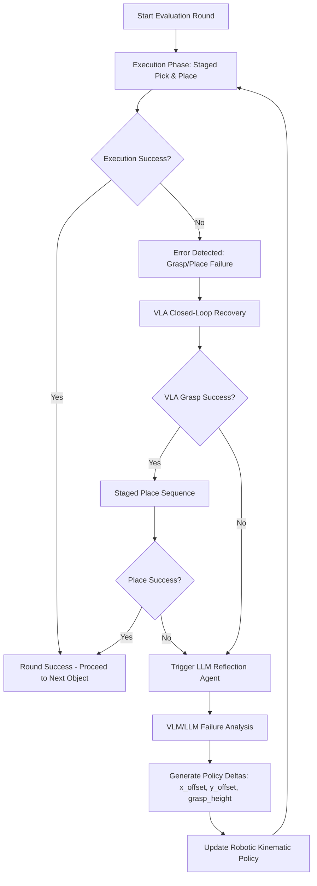

# Project Documentation: Multimodal Agentic "Reflection" for Robotics Error Recovery

This document provides a comprehensive overview of the robotic error recovery project. It describes the system architecture, core components (LLM Reflection and VLA Recovery), codebase directory layout, installation steps, and run instructions.

---

## 1. System Architecture Overview

The system is designed around a closed-loop, hierarchical **Trial-Reflect-Retry** architecture, combining high-level cognitive diagnostics with low-level visual feedback corrections.



The system splits recovery into two main categories:
1. **Low-Level Closed-Loop VLA Correction**: Active alignment corrections at 10Hz using overhead camera feedback (visual pixel errors) and relative coordinates to nudge the gripper directly over the object when a grasp is missed.
2. **High-Level Agentic Reflection**: Diagnosing failures (e.g. object knocked off, joint limits reached) over completed attempts. A Vision-Language-Action or text model analyzes the failure logs and visual scene to optimize control parameters (such as approach heights and XY calibration offsets) for the next retry attempt.

---

## 2. Core Project Components

### A. Main Simulation Runner
*   **File**: `experiments/improved_kinematics_reflection.py`
*   **Description**: Coordinates the PyBullet environment simulation, robot kinematics, camera views, staged pick/place trajectories, VLA recovery triggers, and the main execution loop. It automatically spawns the **Robot Status Monitor** Tkinter GUI and manages all multi-round state transitions.

### B. LLM Reflection Agent
*   **File**: `reflection/llm_reflection_agent.py`
*   **Description**: Connects to LLM/VLM models via **Ollama** (local models like Llama 3.2 Vision) or **OpenAI API**. On error detection, it takes physical attributes, pixel tracking variables, and camera RGB snapshots to diagnose the fault type and return a structured JSON block containing parameter updates (e.g., modifying `x_offset`, `y_offset`, or `grasp_height`).

### C. VLA Recovery Agent
*   **File**: `reflection/vla_recovery_agent.py`
*   **Description**: Handles rapid closed-loop relative offsets. Supports:
    *   `heuristic`: Simulated baseline tracking calculated using PyBullet absolute coordinates and camera metrics (default).
    *   `openvla_local`: Local PyTorch/Transformers forward pass of the OpenVLA model on the GPU.
    *   `openvla_api`: Remote API execution calling a hosted VLA microservice.

### D. Robot Status Monitor GUI
*   **File**: `utils/gui_status.py`
*   **Description**: A Tkinter-based dashboard running in a dedicated thread. It visualizes the current robot stage (Planning, Approaching, Grasping, Lifting, Placing, Reflecting, VLA Recovery), attempt progress, joint angles (degrees), distance to goal, and displays the VLA/LLM decisions and reasoning in real time.

### E. Web Analytics Dashboard
*   **Files**: `run_dashboard.py` and `dashboard/`
*   **Description**: A node/python microservice and a web front-end displaying logged history, metrics, success/failure rates, SQLite database logs, and interactive learning curves.

---

## 3. Directory Layout

```
├── urdf/                           # Robot and Gripper physical URDF meshes
├── models/                         # PyBullet 3D objects and environment assets
├── perception/                     # Camera capture, segmentation, and tracking helpers
├── pymycobot/                      # Mycobot control interface drivers
├── reflection/                     # VLA and LLM Agent core logic files
│   ├── llm_reflection_agent.py
│   └── vla_recovery_agent.py
├── experiments/                    # Main simulation run scripts
│   ├── improved_kinematics_reflection.py
│   └── autonomous_robot_reflection.py
├── utils/                          # Common loggers, GUI window, and environment loader
├── tests/                          # Automated unit and pipeline tests
├── dashboard/                      # Dashboard UI files (HTML/CSS/JS)
├── data/                           # Generated evaluation CSVs, plots, and camera snapshots
├── logs/                           # Execution logs and local SQLite database
├── requirements.txt                # Project dependencies
├── setup.py                        # Package setup installer
└── conftest.py                     # Pytest configuration
```

---

## 4. Setup and Installation

### Prerequisites
- Python 3.10.x installed.
- Ollama installed locally (if utilizing local LLM reflection).

### Step 1: Install Dependencies
Create and activate your virtual environment, then install requirements:
```bash
# Create environment
python -m venv robo_env

# Activate (Windows PowerShell)
.\robo_env\Scripts\Activate.ps1

# Install requirements
pip install -r requirements.txt
```

### Step 2: Configure Environment Variables
Copy `.env.example` to `.env` and adjust the parameters to match your setup:
```bash
copy .env.example .env
```
Key settings in `.env`:
*   `USE_LLM_AGENT=1`: Enables LLM reflection.
*   `LLM_AGENT_BACKEND=ollama` / `LLM_AGENT_MODEL=llama3.2-vision`: Configures the local Ollama LLM.
*   `USE_VLA_RECOVERY=1` / `VLA_BACKEND=heuristic`: Enables closed-loop VLA recovery.

---

## 5. How to Run the Project

### A. Run PyBullet Simulation & GUI Monitor
Make sure your virtual environment is active, then run:
```powershell
$env:PYTHONPATH="."; .\robo_env\Scripts\python.exe experiments/improved_kinematics_reflection.py
```
This will open the PyBullet 3D physics window and the **Robot Status Monitor** window.

### B. Run Automated Test Suites
Run the smoke tests and pipeline tests:
```powershell
# Pre-run smoke tests
.\robo_env\Scripts\python.exe tests/test_pre_run_smoke.py

# Pipeline execution mock tests
$env:PYTHONPATH="."; .\robo_env\Scripts\python.exe tests/test_pipeline.py
```

### C. Run Web Dashboard
To view historical database metrics and execution graphs:
1. Start the backend database API server:
   ```powershell
   .\robo_env\Scripts\python.exe run_dashboard.py
   ```
2. Open your browser and navigate to: `http://localhost:8080`

### D. Run Automated Accuracy & Adaptation Test
To run a fully automated test that verifies the accuracy and learning capabilities of the VLA and LLM modules:
```powershell
.\robo_env\Scripts\python.exe run_accuracy_test.py
```
This runs a simulated trial with deliberate kinematic noise, lets the model re-align itself, and outputs a tabulated accuracy score directly to the terminal when finished.
